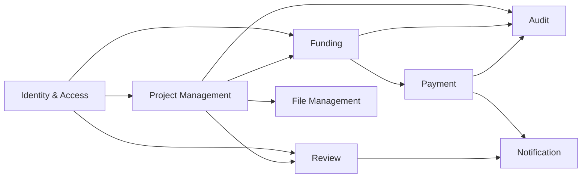
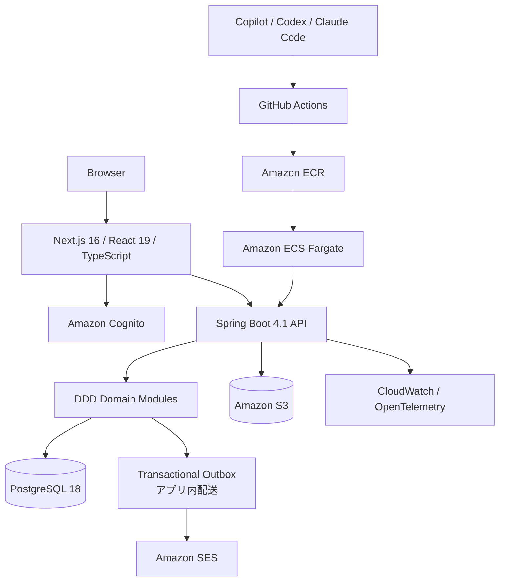

# SES向け教育・実践開発プロジェクト  
# 要件定義書・要件確認書・技術選定書

**前提技術：Amazon Corretto 25 / Kotlin・Java / Spring Boot / DDD / AI駆動開発 / Next.js**

| 項目 | 内容 |
|---|---|
| 文書版 | 1.1 |
| 作成日 | 2026-07-20 |
| 文書状態 | 教育・PoC開始用の暫定確定版 |
| 想定用途 | SES向け若手教育、社内開発、スキルシート実績化 |
| 教育題材 | クラウドファンディング型業務サービス |
| 基本方針 | AIが生成し、人間が判断・承認・責任を持つ |

---

# 0. エグゼクティブサマリー

本プロジェクトでは、次の技術者像を育成する。

> **TypeScript / React / Next.jsによるフロントエンド開発と、Kotlin・Java / Spring Boot / DDDによるバックエンド開発を担当し、AWS・Docker・CI/CD・AIコーディングエージェントを用いて、要件確認から設計、実装、試験、保守まで遂行できる技術者**

中心となる構成は次のとおりである。

```text
フロントエンド
- TypeScript
- React 19.2系
- Next.js 16.2系
- Node.js 24 LTS

バックエンド
- Amazon Corretto 25
- Kotlin主体
- Java併用
- Spring Boot 4.1系
- Spring Framework 7系
- Gradle 9.1以上
- IntelliJ IDEA

設計
- ドメイン駆動設計（DDD）
- モジュラーモノリス
- ヘキサゴナルアーキテクチャ
- CQRS-lite
- ADRによる技術判断記録

AI駆動開発
- GitHub Copilot：IDE内の補完・対話
- OpenAI Codex：リポジトリ単位の調査・実装・レビュー
- Claude Code：必要に応じた独立レビュー
- 人間による承認ゲート

共通基盤
- PostgreSQL 18
- Docker
- AWS
- GitHub Actions
- Terraform
- JUnit 5
- Kotest
- Testcontainers
- Playwright
```

## 0.1 言語構成

JVM上の開発・実行環境は、JavaコードとKotlinコードの双方について**Amazon Corretto 25**に統一する。

初期の推奨コード比率は次のとおりとする。

```text
Kotlin：60～70％
Java：30～40％
```

ただし、同一の集約や同一の機能単位の内部で無秩序に混在させない。原則として、境界づけられたコンテキストまたはモジュール単位で主言語を決める。

例：

| モジュール | 主言語 |
|---|---|
| プロジェクト・募集管理 | Kotlin |
| 支援・決済管理 | Kotlin |
| 会員・権限管理 | Java |
| 外部サービス連携 | Java |
| バッチ・移行処理 | JavaまたはKotlin |
| テスト | Kotlin中心、Javaも併用 |

---

# 第1部　要件定義書

# 1. プロジェクト目的

## 1.1 事業目的

1. 若手技術者に、実案件へ接続できるモダンな開発経験を付与する。
2. Java案件の広い市場と、Kotlin・Next.js・AWSの希少性を両立する。
3. 単なるCRUD研修ではなく、設計・認証・決済・非同期処理・保守運用を含む実践経験を形成する。
4. 教育成果を、SES提案時に説明可能な設計書、コード、試験結果、運用記録として残す。
5. AI駆動開発を利用しつつ、AIへの依存ではなく、AI成果物を検証できる技術者を育成する。

## 1.2 教育目標

研修修了者は、少なくとも次を説明・実行できること。

- 業務要件から機能要件と非機能要件を抽出する。
- 不明点を質問票として整理し、要件を確定する。
- ユビキタス言語と境界づけられたコンテキストを定義する。
- KotlinとJavaを適切に使い分ける。
- Spring BootでREST APIを設計・実装する。
- Next.jsで業務画面を実装する。
- PostgreSQLのテーブル・索引・トランザクションを設計する。
- DockerとAWS上で実行環境を構築する。
- AIに作業を依頼し、差分・試験・セキュリティを人間が確認する。
- 障害調査、ログ解析、改修、再発防止まで行う。

## 1.3 成功判定

次を満たした場合、教育プロジェクトを成功と判断する。

| 指標 | 成功条件 |
|---|---|
| 要件 | 主要機能について要件、受入条件、例外条件が記録されている |
| 設計 | コンテキストマップ、集約、API、DB、ADRが作成されている |
| 実装 | フロント・バック・DB・AWS連携を含む一連の機能が稼働する |
| 品質 | 自動試験、静的解析、依存関係検査を通過する |
| AI利用 | AIの提案を無確認で採用せず、レビュー記録が残る |
| 運用 | ログ、監視、障害対応手順、ロールバック手順が存在する |
| 教育 | 研修者が担当機能を口頭・文書で説明できる |

---

# 2. 対象範囲

## 2.1 対象システム

教育題材として、クラウドファンディング型の業務サービスを構築する。

```text
支援者
  └─ プロジェクトを検索・閲覧・支援する

起案者
  └─ プロジェクトを作成し、審査申請する

審査担当者
  └─ 内容を確認し、承認・差戻し・却下を行う

運用管理者
  └─ 会員、権限、支援、返金、通知、監査情報を管理する
```

## 2.2 対象機能

| ID | 機能群 | 主な機能 |
|---|---|---|
| FR-01 | 会員管理 | 登録、ログイン、退会、プロフィール |
| FR-02 | 認証・認可 | OIDC、ロール、権限制御 |
| FR-03 | プロジェクト管理 | 作成、編集、下書き、公開、終了 |
| FR-04 | 審査 | 申請、承認、差戻し、却下、履歴 |
| FR-05 | 支援 | 金額入力、申込、取消、状態確認 |
| FR-06 | 決済 | 外部決済API、Webhook、冪等性 |
| FR-07 | 返金 | 返金申請、承認、実行、再試行 |
| FR-08 | ファイル | 画像、添付資料、S3保存 |
| FR-09 | 通知 | メール、画面通知、再送 |
| FR-10 | 管理画面 | 検索、ページング、CSV、権限管理 |
| FR-11 | 監査 | 操作履歴、変更履歴、AI利用記録 |
| FR-12 | バッチ | 期限終了、集計、通知、再処理 |
| FR-13 | 保守 | ヘルスチェック、ログ閲覧、障害調査 |

## 2.3 初期対象外

初期教育段階では、次を対象外とする。

- 実際の資金移動を伴う本番決済
- 複数法人を同一環境に収容するマルチテナント
- Kubernetesによる本番運用
- 多数の独立マイクロサービス
- 高頻度取引相当の大規模処理
- 生成AIによる自動審査・自動与信
- AIによる本番環境への直接変更
- AIによるプルリクエストの無人マージ

---

# 3. 利用者と権限

| ロール | 主な権限 |
|---|---|
| GUEST | 公開プロジェクト閲覧 |
| SUPPORTER | 支援、履歴確認、プロフィール管理 |
| OWNER | プロジェクト作成、編集、申請 |
| REVIEWER | 審査、差戻し、承認、却下 |
| OPERATOR | 支援・返金・通知の運用 |
| ADMIN | 会員、権限、全体設定 |
| AUDITOR | 監査ログの参照 |
| DEVELOPER | 開発・検証環境のみ操作 |
| AI_AGENT | 制限された開発作業のみ。人間の承認なしにマージ・本番操作は不可 |

認可は画面表示の制御だけでなく、バックエンドAPIで必ず検証する。

---

# 4. ドメイン駆動設計要件

## 4.1 ユビキタス言語

最低限、次の用語を業務・設計・コードで統一する。

| 用語 | 定義 |
|---|---|
| プロジェクト | 資金募集の対象となる企画 |
| 起案者 | プロジェクトを作成・運営する主体 |
| 支援者 | プロジェクトへ資金提供を申し込む利用者 |
| 支援 | 支援者による申込行為 |
| 審査申請 | 下書き状態のプロジェクトを審査へ提出する行為 |
| 承認 | プロジェクトの公開を許可する判断 |
| 差戻し | 修正後の再申請を要求する判断 |
| 成立 | 所定条件を満たして募集が完了した状態 |
| 不成立 | 所定条件を満たさず募集が終了した状態 |
| 返金 | 支援金を支援者へ戻す処理 |
| 決済結果 | 外部決済サービスから受領した確定情報 |
| 冪等キー | 同一要求の重複処理を防止する識別子 |

## 4.2 境界づけられたコンテキスト



| コンテキスト | 責務 |
|---|---|
| Identity & Access | 会員、認証、ロール、権限 |
| Project Management | プロジェクト、募集期間、公開状態 |
| Review | 審査申請、判断、差戻し、履歴 |
| Funding | 支援申込、取消、成立判定 |
| Payment | 決済要求、Webhook、返金、冪等性 |
| Notification | メール、画面通知、再送 |
| File Management | S3ファイル、メタデータ、アクセス制御 |
| Audit | 操作、変更、AI支援、重要イベントの記録 |

## 4.3 集約の例

```text
Project集約
- Project
- ProjectId
- ProjectStatus
- FundingPeriod
- FundingTarget
- RewardPlan

Support集約
- Support
- SupportId
- SupportAmount
- PaymentStatus
- IdempotencyKey

Review集約
- ReviewRequest
- ReviewDecision
- ReviewComment
```

## 4.4 設計原則

1. 集約外から内部Entityを直接更新しない。
2. 状態遷移はドメインメソッドで表現する。
3. 金額、期間、ID、状態は可能な限りValue Objectとする。
4. ドメイン層はSpring、DB、HTTP、AWS SDKへ依存しない。
5. Repositoryはドメイン側にインターフェースを置く。
6. 外部決済・メール・S3はPortとAdapterで分離する。
7. コンテキスト間連携は、直接テーブル参照ではなくAPIまたはイベントを用いる。
8. 初期構成はモジュラーモノリスとし、必要性が確認された境界だけを後から分離する。

---

# 5. AI駆動開発要件

## 5.1 基本原則

AI駆動開発とは、AIに開発責任を移すことではない。

> **AIが分析・提案・生成を行い、人間が要件、設計、差分、試験結果、リスクを確認して承認する開発方式**

AIは、次の工程で利用する。

| 工程 | AIに担当させる作業 | 人間が行う判断 |
|---|---|---|
| 要件定義 | 要求整理、不明点抽出、受入条件案 | 業務要件の確定 |
| 要件確認 | 矛盾検出、質問票作成、漏れ確認 | 顧客への確認、回答承認 |
| 技術選定 | 選択肢、比較表、リスク案 | 採否と責任 |
| DDD | 用語候補、境界候補、モデル案 | 実際の業務境界の決定 |
| 実装 | コード、設定、移行スクリプト | 差分レビュー、採用判断 |
| テスト | ケース、テストコード、異常系 | 妥当性確認、追加試験 |
| レビュー | 不具合、脆弱性、設計逸脱の指摘 | 修正要否の判断 |
| 文書 | ADR、API説明、運用手順の草案 | 正確性と最終承認 |
| 保守 | ログ分析、原因候補、修正案 | 原因確定、リリース判断 |

## 5.2 AI利用制約

AIエージェントには次を禁止する。

- 本番秘密情報の入力
- 実在顧客の個人情報の入力
- 本番DBへの直接接続
- 本番AWSアカウントへの管理者権限付与
- mainブランチへの直接push
- 人間の承認なしでのマージ
- 人間の承認なしでの本番デプロイ
- ライセンス不明コードの大量転載
- 試験を通す目的だけの仕様改変
- 既存のセキュリティ制御の無断解除

## 5.3 AI用コンテキスト

リポジトリに次の情報を保持する。

```text
/AGENTS.md
/docs/requirements/
/docs/domain/
/docs/architecture/
/docs/adr/
/docs/api/
/docs/operations/
/prompts/
/evals/
```

`AGENTS.md`には最低限、次を記載する。

- プロジェクト目的
- 技術スタック
- DDD境界
- 禁止依存関係
- コーディング規約
- テスト実行方法
- セキュリティ上の禁止事項
- 変更してはならない領域
- 完了条件
- AIが不明点を推測せず質問として残す規則

## 5.4 AI成果物の受入条件

AIが生成した変更は、最低限次を満たすまで採用しない。

- ビルド成功
- 単体試験成功
- 結合試験成功
- E2E試験成功
- 静的解析成功
- アーキテクチャテスト成功
- 依存関係・脆弱性検査成功
- 人間による差分レビュー
- 要件またはチケットとの対応確認
- 必要なADR・運用文書の更新

---

# 6. 非機能要件

## 6.1 性能

| ID | 要件 |
|---|---|
| NFR-P01 | 通常APIの95パーセンタイル応答時間を500ms以内とする |
| NFR-P02 | 検索APIは適切な索引とページングを使用する |
| NFR-P03 | 大容量ファイルをアプリケーションサーバーへ保持せず、署名付きURLを利用する |
| NFR-P04 | 外部API呼出しにはタイムアウト、再試行、サーキットブレーカー方針を持つ |
| NFR-P05 | バッチ処理は再実行可能とする |

## 6.2 可用性・復旧

| 項目 | 初期目標 |
|---|---|
| 可用性 | 月間99.5％ |
| RTO | 4時間 |
| RPO | 24時間以内 |
| DBバックアップ | 日次＋必要に応じたポイントインタイムリカバリ |
| デプロイ失敗 | 直前イメージへロールバック可能 |
| 外部API障害 | キューまたは再試行管理へ退避 |

## 6.3 セキュリティ

- OIDC/OAuth 2.0を基本とする。
- 認証情報はAmazon Cognitoまたは同等のIdPで管理する。
- ブラウザへ長期有効なアクセストークンを保存しない。
- Next.jsはBFFとして利用し、CookieはHttpOnly、Secure、SameSiteを設定する。
- バックエンドはSpring Securityで認証・認可する。
- CSRF、XSS、SQL Injection、SSRF、パストラバーサル対策を実施する。
- S3は非公開を原則とし、署名付きURLで一時アクセスを許可する。
- 秘密情報はAWS Secrets ManagerまたはSSM Parameter Storeで管理する。
- 重要操作は監査ログへ記録する。
- 依存パッケージとコンテナイメージを継続的に検査する。
- AIプロンプトに秘密情報・個人情報を含めない。

## 6.4 保守性

- 1クラス・1関数の責務を限定する。
- コンテキスト間の依存方向をArchUnit等で検査する。
- DB変更はFlywayでバージョン管理する。
- API仕様はOpenAPIで管理する。
- 重要な技術判断はADRで記録する。
- ログには相関ID・利用者ID・処理IDを付与する。
- 障害調査に必要なメトリクスとトレースを用意する。

## 6.5 テスト品質

| 対象 | 目安 |
|---|---:|
| ドメイン層 | 行カバレッジ90％以上 |
| アプリケーション全体 | 行カバレッジ80％以上 |
| 重要状態遷移 | 正常系・異常系・境界値を100％用意 |
| 決済・返金 | 冪等性、重複通知、タイムアウト、再試行を試験 |
| 認可 | ロール別の許可・拒否を自動試験 |
| E2E | 主要ユーザーストーリーをPlaywrightで試験 |

カバレッジ率だけで品質を判断せず、ミューテーションテストやレビューでテストの有効性を確認する。

---

# 7. 教育要件

## 7.1 教育段階

### 第1段階：基礎（1～3か月）

```text
Java 25基礎
Kotlin基礎
オブジェクト指向
SQL
Git / GitHub
Gradle
JUnit 5
Docker
AIへの指示方法
AI生成コードの読み方
```

### 第2段階：Web開発（4～6か月）

```text
Spring Boot
Spring Security
REST API
PostgreSQL
Flyway
TypeScript
React
Next.js
OpenAPI
Testcontainers
```

### 第3段階：設計・DDD（7～9か月）

```text
ユビキタス言語
境界づけられたコンテキスト
Entity / Value Object / Aggregate
Repository
Domain Service
Domain Event
ヘキサゴナルアーキテクチャ
Spring Modulith
ArchUnit
ADR
```

### 第4段階：AI駆動・クラウド・保守（10～12か月）

```text
Codex / Copilot / Claude Code
要件確認支援
AIによる実装・テスト生成
AWS
Terraform
GitHub Actions
監視
障害対応
性能改善
セキュリティレビュー
コードレビュー
```

## 7.2 教育上の禁止事項

- AIの出力を理解せずにコミットする。
- コンパイル成功だけで完了と判断する。
- DDDの用語だけを使い、業務ルールをモデル化しない。
- 研修のためだけに不要なマイクロサービスを増やす。
- フレームワークの都合をドメインモデルへ持ち込む。
- テストを後回しにする。
- 実在データをAIや検証環境へ投入する。

---

# 8. 成果物要件

| 分類 | 成果物 |
|---|---|
| 要件 | 要件定義書、要件確認票、ユースケース、受入条件 |
| DDD | 用語集、コンテキストマップ、ドメインモデル |
| 設計 | システム構成図、API設計、DB設計、シーケンス図 |
| 判断 | ADR、技術比較表、採否理由 |
| 実装 | ソースコード、Dockerfile、Terraform |
| 試験 | テスト仕様、テストコード、結果報告 |
| AI | AGENTS.md、標準プロンプト、AIレビュー記録 |
| 運用 | デプロイ、監視、障害対応、バックアップ手順 |
| 教育 | 担当記録、レビュー記録、振り返り、スキル評価 |

---

# 第2部　要件確認書

# 9. 確認済み・暫定確定事項

以下は本書作成時の既定値である。明示的な変更がない限り、この内容で設計を進める。

| ID | 確認項目 | 決定内容 | 状態 |
|---|---|---|---|
| C-01 | JVM | Amazon Corretto 25 | 確定 |
| C-02 | JDKサポート方針 | LTS版を使用し、四半期更新を適用 | 確定 |
| C-03 | バックエンド | Kotlin主体＋Java併用 | 確定 |
| C-04 | Kotlin・Java比率 | Kotlin 60～70％、Java 30～40％ | 暫定確定 |
| C-05 | フレームワーク | Spring Boot 4.1系 | 確定 |
| C-06 | アーキテクチャ | DDD＋モジュラーモノリス | 確定 |
| C-07 | フロントエンド | TypeScript＋React＋Next.js | 確定 |
| C-08 | DB | PostgreSQL 18 | 確定 |
| C-09 | IDE | IntelliJ IDEA中心、VS Code併用可 | 確定 |
| C-10 | AI開発 | AI生成＋人間承認方式 | 確定 |
| C-11 | AI標準 | Copilot＋Codex、Claude Codeは任意 | 暫定確定 |
| C-12 | クラウド | AWS | 確定 |
| C-13 | IaC | Terraform | 暫定確定 |
| C-14 | 初期構成 | マイクロサービス化しない | 確定 |
| C-15 | 決済 | 教育段階はSandbox・モック | 確定 |
| C-16 | データ | 架空・匿名化・合成データのみ | 確定 |
| C-17 | 本番操作 | AI単独実行を禁止 | 確定 |
| C-18 | 認証 | OIDC、AWSではCognitoを第一候補 | 暫定確定 |

---

# 10. 要件確認時の質問票

実案件へ転用する際は、次を顧客または事業責任者へ確認する。

## 10.1 業務要件

1. 募集方式はAll-or-NothingかAll-inか。
2. 支援の取消可能期間はいつまでか。
3. プロジェクト公開後の変更可能項目は何か。
4. 審査担当者は一名承認か複数承認か。
5. 差戻し回数に上限はあるか。
6. 募集成立後に起案者へ支払う条件は何か。
7. 返金の起点は自動か、運用担当者の承認か。
8. 手数料、消費税、振込費用をどの時点で計算するか。
9. 法令上保存すべき記録と保存期間は何年か。
10. 管理者が代理操作できる範囲はどこまでか。

## 10.2 非機能要件

1. 月間利用者数、同時接続数、ピーク時間帯はどの程度か。
2. 月間取引件数と最大支援件数はどの程度か。
3. 計画停止を許容できる時間帯はあるか。
4. RTOとRPOは何時間か。
5. 個人情報・決済情報の保管範囲はどこまでか。
6. 監査ログの保存期間は何年か。
7. 利用可能なAIサービスとデータ取扱条件は何か。
8. ソースコードを外部AIへ送信できるか。
9. 障害通知先と一次対応時間は何分以内か。
10. 脆弱性対応の期限はどの程度か。

## 10.3 AI利用要件

1. 顧客コードを外部AIへ送信してよいか。
2. AIプロンプトと応答を保存する必要があるか。
3. 保存する場合、保存期間とアクセス権限はどうするか。
4. AI生成コードであることを記録する必要があるか。
5. 利用可能なモデル・地域・契約プランに制限があるか。
6. AIにコマンド実行を許可する範囲はどこまでか。
7. AIによるプルリクエスト作成を許可するか。
8. AIレビューだけで人間レビューを省略できるか。
9. OSSライセンス確認をどのように実施するか。
10. AIの誤生成による事故責任を誰が負うか。

---

# 11. 受入条件

## 11.1 機能受入

- 起案者がプロジェクトを作成し、審査へ申請できる。
- 審査担当者が承認・差戻し・却下できる。
- 承認済みプロジェクトだけが公開される。
- 支援者が支援を申し込み、決済結果を確認できる。
- 同一Webhookが複数回来ても重複計上されない。
- 不成立時に返金対象が正しく抽出される。
- ロールに応じて利用可能な操作が制限される。
- 管理者操作と重要状態変更が監査ログへ残る。

## 11.2 技術受入

- Corretto 25でビルド・テスト・実行できる。
- KotlinとJavaのJVMターゲットが25で一致している。
- Gradle Wrapperで環境差異なくビルドできる。
- DDD境界に反する依存をアーキテクチャテストで検出できる。
- PostgreSQLをTestcontainersで起動して結合試験できる。
- Next.jsからSpring Boot APIへ安全に接続できる。
- Docker Composeでローカル環境を再現できる。
- GitHub Actionsで品質ゲートを自動実行できる。
- Terraformで検証環境を再構築できる。
- AIが生成した変更に人間の承認記録が残る。

---

# 12. リスクと対策

| リスク | 内容 | 対策 |
|---|---|---|
| 最新技術偏重 | Java 25やSpring Boot 4の案件がまだ限定される | Java 21・Spring Boot 3系の差分も教育資料で扱う |
| Kotlin案件不足 | 大阪常駐ではKotlin案件が少ない可能性 | Java実務能力を維持し、東京リモートも営業対象にする |
| DDDの形式化 | 用語だけで複雑な構成になる | 業務ルールが存在する箇所だけにDDDを適用する |
| 過剰分割 | 研修目的でマイクロサービスを増やす | 初期はモジュラーモノリスを固定する |
| AI依存 | 技術者がコードを説明できなくなる | 説明試験、差分レビュー、手動修正を必須にする |
| AI誤生成 | 存在しないAPIや脆弱なコードを生成する | 公式資料、ビルド、試験、静的解析で検証する |
| 情報漏えい | 秘密情報・顧客コードを外部AIへ送る | 契約、権限、除外設定、ダミーデータを徹底する |
| 複雑性増加 | JPA、MyBatis、イベント等が同時に増える | 段階導入し、初期はCRUDと単一DBに限定する |
| コスト増加 | AI、IDE、AWSの利用料が増える | 開発環境停止、予算アラート、必要プランのみ契約 |
| 更新追随 | Java・Node・Next.jsの更新が速い | Renovate/Dependabotと四半期更新日を設ける |

---

# 第3部　技術選定書

# 13. 全体アーキテクチャ



## 13.1 配置方針

- フロントエンドはNext.jsを利用する。
- バックエンドはSpring BootによるREST APIとする。
- 初期は単一デプロイ可能なモジュラーモノリスとする。
- DBは単一PostgreSQLとし、コンテキスト単位でスキーマまたはテーブル所有を明確にする。
- 非同期処理はTransactional Outboxで実装する。**配送先はアプリ内Handlerとし、SQSは採用しない**（ADR-0008）。
- Kafkaは初期導入しない。
- AWSではECS Fargateを第一候補とする。
- 小規模PoCではApp Runnerへの置換も可能とする。

---

# 14. 技術選定一覧

| 分類 | 採用技術 | 選定理由 |
|---|---|---|
| JDK | Amazon Corretto 25 | 無償、OpenJDK互換、LTS、AWSとの親和性 |
| JVM言語 | Kotlin＋Java | Kotlinの生産性とJava案件への対応力を両立 |
| Backend | Spring Boot 4.1系 | Java 25対応、エンタープライズ開発、Spring資産 |
| Framework | Spring Framework 7系 | Spring Boot 4の基盤 |
| Build | Gradle 9.1以上 | Java 25実行対応、Kotlin DSL、Toolchain |
| IDE | IntelliJ IDEA | Java/Kotlin、Spring、Gradle、リファクタリング |
| DDD補助 | Spring Modulith | モジュール境界、イベント、文書化 |
| Architecture Test | ArchUnit | 依存方向とレイヤー違反を自動検査 |
| API | REST＋OpenAPI | SES案件で説明しやすく、連携性が高い |
| ORM | Spring Data JPA | 集約の永続化と更新処理 |
| Query | MyBatis | 複雑検索、帳票、国内Java案件との親和性 |
| Migration | Flyway | DB変更のバージョン管理 |
| DB | PostgreSQL 18 | ACID、SQL、JSON、拡張性 |
| Frontend | Next.js 16.2系 | Reactベースのフルスタック開発 |
| UI | React 19.2系 | コンポーネント型UIの標準技術 |
| Language | TypeScript 5系 | 型安全性、保守性、AI生成コードの検査 |
| Runtime | Node.js 24 LTS | 本番向けLTS |
| Form | React Hook Form＋Zod | 入力制御と型安全な検証 |
| Fetch | TanStack Query | サーバー状態、キャッシュ、再取得 |
| E2E | Playwright | ブラウザ自動試験 |
| Container | Docker | 環境再現性 |
| Cloud | AWS | SES案件、市場性、Correttoとの整合 |
| IaC | Terraform | クラウド横断性と案件市場性 |
| CI/CD | GitHub Actions | リポジトリ連携と自動品質ゲート |
| Monitoring | OpenTelemetry＋CloudWatch | ログ、メトリクス、トレース |
| AI補完 | GitHub Copilot | IntelliJ内での補完と対話 |
| AI Agent | OpenAI Codex | リポジトリ単位の調査、実装、レビュー |
| AI Review | Claude Code | 独立視点のレビュー候補 |

---

# 15. Amazon Corretto 25採用方針

Amazon Corretto 25は、開発・CI・コンテナ・本番で統一する。

## 15.1 Gradle設定例

```kotlin
java {
    toolchain {
        languageVersion.set(JavaLanguageVersion.of(25))
        vendor.set(JvmVendorSpec.AMAZON)
    }
}

kotlin {
    jvmToolchain(25)
    compilerOptions {
        jvmTarget.set(org.jetbrains.kotlin.gradle.dsl.JvmTarget.JVM_25)
    }
}
```

## 15.2 Docker方針

```dockerfile
FROM amazoncorretto:25 AS runtime
```

実際には、ビルド用と実行用を分離したマルチステージビルドを採用する。

## 15.3 Java 25利用方針

利用を推奨する機能：

- record
- sealed class / sealed interface
- pattern matching
- switch expression
- text block
- virtual thread
- immutable collection
- module import等の正式機能

原則としてPreview機能は本番コードに使用しない。

---

# 16. Kotlin・Java共存方針

## 16.1 原則

- ランタイムとビルドJDKはCorretto 25へ統一する。
- JavaとKotlinのターゲット不一致をCIでエラーにする。
- 同一クラスをJava版とKotlin版で重複実装しない。
- 同一集約内部の主言語は統一する。
- KotlinからJavaを呼ぶ際はnullabilityを明確にする。
- Java APIへ公開するKotlinコードは、Java利用者から見たAPI形状を確認する。
- LombokはKotlin側では使用しない。
- Kotlinのdata classを無条件にEntityへ使用しない。
- Java recordをJPA Entityへ直接使用しない。

## 16.2 推奨分担

```text
Kotlin
- ドメインモデル
- アプリケーションサービス
- 新規API
- テストコード
- 型安全な業務ルール

Java
- 会員・権限モジュール
- 外部ライブラリ連携
- 既存Java資産との接続
- バッチ
- Java案件を想定した実装演習
```

---

# 17. DDD実装アーキテクチャ

## 17.1 パッケージ構成例

```text
com.example.crowdfunding
├─ identity
│  ├─ domain
│  ├─ application
│  ├─ adapter
│  │  ├─ in
│  │  └─ out
│  └─ config
├─ project
│  ├─ domain
│  │  ├─ model
│  │  ├─ service
│  │  ├─ event
│  │  └─ repository
│  ├─ application
│  │  ├─ command
│  │  ├─ query
│  │  └─ usecase
│  ├─ adapter
│  │  ├─ in
│  │  │  └─ web
│  │  └─ out
│  │     ├─ persistence
│  │     └─ event
│  └─ config
├─ funding
├─ payment
├─ notification
└─ shared
   └─ kernel
```

## 17.2 依存方向

```text
adapter → application → domain
```

ドメイン層から、次へ依存してはならない。

```text
Spring
JPA / Hibernate
MyBatis
AWS SDK
HTTPクライアント
Next.js
DB固有型
```

## 17.3 CQRS-lite

分散CQRSは採用しない。

- 更新系：集約、Spring Data JPA
- 参照系：専用DTO、MyBatis
- DB：同一PostgreSQL
- イベント：同一アプリ内イベント＋Outbox
- 非同期化が必要な処理はOutbox経由でアプリ内Handlerへ配送する（当初はSQSを想定したが、単一Backend構成では分離の利得が無いため不採用。ADR-0008）

これにより、DDDを学びながらも、運用複雑性を抑える。

---

# 18. フロントエンド選定

## 18.1 採用構成

```text
Node.js 24 LTS
TypeScript 5系
React 19.2系
Next.js 16.2系
App Router
React Hook Form
Zod
TanStack Query
Vitest
Playwright
```

## 18.2 設計方針

- Reactの基礎を理解した後にNext.jsを使用する。
- Server ComponentとClient Componentを意識して分離する。
- Client Componentを必要以上に増やさない。
- 入力値はZodで検証する。
- APIレスポンス型をOpenAPIから生成する。
- 認証処理はBFF側へ寄せる。
- 画面固有状態とサーバー状態を混同しない。
- 業務ルールをフロントだけに実装しない。
- E2E試験は主要ユーザーストーリーを対象とする。

---

# 19. AIツール選定

## 19.1 標準構成

### GitHub Copilot

用途：

- IntelliJ IDEA内のコード補完
- 小規模な関数・テストの生成
- コード説明
- リファクタリング案
- IDE内での質疑

### OpenAI Codex

用途：

- リポジトリ全体の調査
- 複数ファイルをまたぐ実装
- 要件とコードの照合
- テスト実行
- プルリクエスト単位のレビュー
- 文書・ADR・移行手順の作成

### Claude Code

用途：

- 重要変更のセカンドレビュー
- 大規模な依存関係の確認
- 別モデルによる設計・セキュリティ検証

## 19.2 コストを抑える場合

最低構成：

```text
IntelliJ IDEA
＋
OpenAI Codex CLI / App
```

IDE補完を重視する場合：

```text
IntelliJ IDEA
＋
GitHub Copilot
```

品質を重視する変更だけ、別モデルのレビューを追加する。

## 19.3 AIワークフロー

```mermaid
flowchart LR
    HumanReq[人間：業務要求]
    AIReq[AI：要求整理・質問抽出]
    HumanApprove[人間：要件承認]
    AIDesign[AI：設計案・ADR案]
    HumanDesign[人間：設計判断]
    AICode[AI：実装・試験生成]
    CI[CI：ビルド・試験・解析]
    AIReview[別AI：レビュー]
    HumanReview[人間：差分レビュー]
    Merge[マージ]
    Deploy[承認付きデプロイ]

    HumanReq --> AIReq
    AIReq --> HumanApprove
    HumanApprove --> AIDesign
    AIDesign --> HumanDesign
    HumanDesign --> AICode
    AICode --> CI
    CI --> AIReview
    AIReview --> HumanReview
    HumanReview --> Merge
    Merge --> Deploy
```



---

# 20. テスト戦略

| テスト層 | 技術 | 対象 |
|---|---|---|
| ドメイン単体 | JUnit 5 / Kotest | Entity、Value Object、状態遷移 |
| アプリケーション | JUnit 5 / MockK / Mockito | UseCase、権限、トランザクション |
| 永続化 | Testcontainers PostgreSQL | JPA、MyBatis、Flyway |
| API | Spring Boot Test | HTTP、Validation、認証・認可 |
| 外部連携 | WireMock / LocalStack | 決済、S3、SES |
| 契約 | OpenAPI検証 | FrontendとBackendの契約 |
| フロント単体 | Vitest | 関数、Hook、Component |
| E2E | Playwright | 登録、申請、審査、支援、返金 |
| アーキテクチャ | ArchUnit | 依存方向、モジュール境界 |
| セキュリティ | CodeQL等 | 脆弱性、危険な依存 |
| 品質検証 | PIT等 | テストの有効性 |

AIには正常系だけでなく、次の異常系を必ず生成させる。

- null、空文字、最大長超過
- 境界金額
- 日付境界
- 二重送信
- 並行更新
- 権限不足
- 外部APIタイムアウト
- Webhook重複
- DBロック
- キュー再配信
- 通知失敗
- ロールバック後の再実行

---

# 21. CI/CD・品質ゲート

```text
Pull Request
↓
Format
↓
Compile
↓
Unit Test
↓
Architecture Test
↓
Integration Test
↓
Frontend Test
↓
E2E Test
↓
Static Analysis
↓
Dependency / Container Scan
↓
AI Review
↓
Human Review
↓
Merge
↓
Build Image
↓
Deploy to Development
↓
Smoke Test
↓
Manual Approval
↓
Deploy to Production
```

## 21.1 マージ条件

- CIが全て成功している。
- 人間の承認者が一名以上いる。
- AIだけの承認ではない。
- 重要なドメイン変更にはADRがある。
- DB変更にはFlywayスクリプトとロールバック方針がある。
- API変更にはOpenAPI更新がある。
- セキュリティ上のHigh/Critical指摘が残っていない。

---

# 22. 開発環境

## 22.1 ローカル環境

```text
Windows 11
IntelliJ IDEA
Amazon Corretto 25
Gradle Wrapper
Node.js 24 LTS
Docker Desktop
PostgreSQL 18 Container
LocalStack
Git
GitHub CLI
Codex CLI
```

## 22.2 Docker Compose対象

- PostgreSQL
- LocalStack
- Keycloakまたは認証モック
- Mailpit
- OpenTelemetry Collector
- 必要に応じてRedis

Redisは具体的なキャッシュ・分散ロック要件が発生するまで必須としない。

---

# 23. SES向けスキルシート表現

## 23.1 推奨表現

> Amazon Corretto 25上で、KotlinおよびJavaを用いたSpring Boot 4系の業務Webサービスを開発。DDDに基づき、ユビキタス言語、境界づけられたコンテキスト、集約、Value Object、Repository、Domain Eventを設計。Spring ModulithとArchUnitでモジュール境界を検証し、PostgreSQL、Docker、AWS、Terraform、GitHub Actionsを用いて開発・試験・デプロイを実施。フロントエンドはTypeScript、React、Next.jsで構築。GitHub CopilotおよびOpenAI Codexを利用し、要件確認、実装、テスト生成、レビューを効率化しつつ、人間による品質確認と承認を実施。

## 23.2 短縮表現

```text
Kotlin / Java 25 / Spring Boot 4 / DDD
TypeScript / React 19 / Next.js 16
PostgreSQL / Docker / AWS / Terraform
GitHub Actions / Testcontainers / Playwright
Copilot / Codexを利用したAI駆動開発
```

## 23.3 面談で説明すべき事項

- AIへ何を任せ、何を人間が判断したか。
- DDDでどの境界を定義したか。
- なぜマイクロサービスではなくモジュラーモノリスにしたか。
- KotlinとJavaをどの単位で使い分けたか。
- 冪等性とWebhook重複をどう処理したか。
- JPAとMyBatisをどう使い分けたか。
- どの試験を自動化したか。
- 障害時にどのログ・メトリクスを確認するか。
- AI生成コードの誤りをどのように検出したか。

---

# 24. 最終選定

本教育プロジェクトの正式な中心構成は次とする。

```text
【フロントエンド】
Node.js 24 LTS
TypeScript
React 19.2
Next.js 16.2
React Hook Form
Zod
TanStack Query
Vitest
Playwright

【バックエンド】
Amazon Corretto 25
Kotlin 60～70％
Java 30～40％
Spring Boot 4.1
Spring Framework 7
Spring Security
Spring Modulith
Spring Data JPA
MyBatis
Flyway
JUnit 5
Kotest
Testcontainers
ArchUnit
Gradle 9.1以上

【アーキテクチャ】
DDD
モジュラーモノリス
ヘキサゴナルアーキテクチャ
CQRS-lite
Transactional Outbox
ADR

【インフラ】
PostgreSQL 18
Docker
AWS
ECS Fargate
RDS
S3
SES
Cognito
CloudWatch
OpenTelemetry
Terraform
GitHub Actions

【AI駆動開発】
GitHub Copilot
OpenAI Codex
Claude Code（重要変更の任意レビュー）
AGENTS.md
AI利用ログ
人間承認ゲート
```

## 24.1 最終方針

> **Kotlinを主言語、Javaを副言語とし、両方をAmazon Corretto 25上で稼働させる。Spring Boot 4.1とDDDを用いてモジュラーモノリスを構築し、Next.js 16によるフロントエンド、AWS・Docker・CI/CDを組み合わせる。AIは要件確認から保守まで利用するが、要件確定、設計判断、コード採用、マージ、本番リリースは人間が承認する。**

---

# 付録A　Definition of Done

1. 要件またはチケット番号が明記されている。
2. 受入条件が明記されている。
3. DDD上の所属コンテキストが明確である。
4. コードがCorretto 25でビルドできる。
5. JavaとKotlinのJVMターゲットが一致する。
6. 単体試験が追加されている。
7. 必要な結合試験・E2E試験が追加されている。
8. CIが成功している。
9. 静的解析と脆弱性検査が成功している。
10. API・DB変更が文書へ反映されている。
11. AI生成部分を人間がレビューしている。
12. ログに秘密情報や個人情報を出力していない。
13. 運用・ロールバック方法が確認されている。
14. 担当者が実装内容を説明できる。
15. 人間の承認者がマージを承認している。

---

# 付録B　ADRテンプレート

```markdown
# ADR-XXXX: 技術判断の名称

## 状態
提案 / 採用 / 廃止 / 置換

## 背景
どのような要件・問題があるか。

## 判断
何を採用するか。

## 選択肢
1. 選択肢A
2. 選択肢B
3. 選択肢C

## 判断理由
要件、コスト、性能、保守性、教育効果。

## 結果
利点、不利益、運用上の注意。

## AI利用
AIが提示した案と、人間が変更・却下した点。

## 承認者
氏名、日付。
```

---

# 付録C　公式資料

- [Amazon Corretto 25 Downloads](https://docs.aws.amazon.com/corretto/latest/corretto-25-ug/downloads-list.html)
- [Amazon Corretto 25 Overview](https://docs.aws.amazon.com/corretto/latest/corretto-25-ug/what-is-corretto-25.html)
- [Spring Boot System Requirements](https://docs.spring.io/spring-boot/system-requirements.html)
- [Gradle Compatibility Matrix](https://docs.gradle.org/current/userguide/compatibility.html)
- [Gradle Java Toolchains](https://docs.gradle.org/current/userguide/toolchains.html)
- [Kotlin JVM Target](https://kotlinlang.org/api/kotlin-gradle-plugin/kotlin-gradle-plugin-api/org.jetbrains.kotlin.gradle.dsl/-kotlin-jvm-options/jvm-target.html)
- [IntelliJ IDEA Supported Java Versions](https://www.jetbrains.com/help/idea/supported-java-versions.html)
- [Next.js Documentation](https://nextjs.org/docs)
- [React Versions](https://react.dev/versions)
- [Node.js Releases](https://nodejs.org/en/about/previous-releases)
- [PostgreSQL 18 Documentation](https://www.postgresql.org/docs/18/)
- [OpenAI Codex](https://github.com/openai/codex)
- [Claude Code Security](https://docs.anthropic.com/en/docs/claude-code/security)
- [GitHub Copilot](https://github.com/features/copilot)

---

# English Executive Summary

This document defines the requirements, requirement-confirmation process, and technology selection for a junior-engineer training and practical development project.

The selected stack is:

```text
Frontend:
- Node.js 24 LTS
- TypeScript
- React 19.2
- Next.js 16.2

Backend:
- Amazon Corretto 25
- Kotlin as the primary language
- Java as a secondary language
- Spring Boot 4.1
- Gradle 9.1 or later
- IntelliJ IDEA

Architecture:
- Domain-Driven Design
- Modular monolith
- Hexagonal architecture
- CQRS-lite
- Transactional outbox

Infrastructure:
- PostgreSQL 18
- Docker
- AWS
- Terraform
- GitHub Actions

AI-driven development:
- GitHub Copilot
- OpenAI Codex
- Claude Code for optional independent review
- Mandatory human approval gates
```

The JVM runtime and build environment are standardized on Amazon Corretto 25 for both Kotlin and Java. The recommended source-code ratio is approximately 60–70 percent Kotlin and 30–40 percent Java.

AI is used throughout requirements analysis, design, coding, testing, review, documentation, and maintenance. However, humans remain responsible for approving requirements, architecture decisions, code changes, merges, and production deployments.

The project begins as a modular monolith rather than a microservice system. DDD boundaries are enforced through package and module rules, architecture tests, Spring Modulith, and ADRs. This approach provides practical DDD experience without introducing unnecessary operational complexity.
