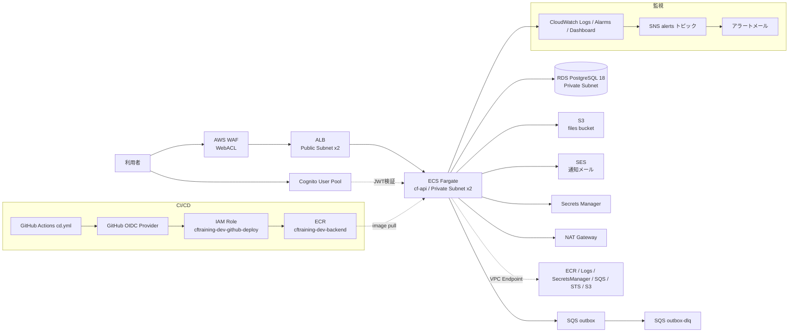

# AWS 契約・構築手順書 — CF-Training

- 文書種別: 契約・初期設定・構築・運用手順書
- 対象システム: CF-Training（クラウドファンディング型教育・実践開発システム）
- 対象リポジトリ: `F:\11\CF`（GitHub: `rice-3/cf`）
- 上位文書: 基本設計 BD-CF-001 §11〜§13 / 詳細設計 DD-CF-001 §12〜§13 / ADR-007（IaC=Terraform）
- 対象リージョン: 東京 `ap-northeast-1`
- 対象環境: `dev`（`staging` / `production` は同手順で `environment` を変えて構築）
- IaC: `infra/terraform/`（Terraform >= 1.9 / AWS Provider ~> 5.70）
- CI/CD: GitHub Actions + GitHub OIDC（`.github/workflows/cd.yml`）
- 基準日: 2026-07-26

> **本書の位置づけ**
>
> `infra/terraform/README.md` は「IaC の内容と使い方」を記述する。本書は「AWS アカウントを契約してから
> CD が回るまで」の**時系列の作業手順**と、apply 前後に AWS 側で手作業が必要な事項を記述する。
> 日常運用（バッチ再実行・返金・障害切り分け）は `docs/ops/runbook.md`、アラート閾値は
> `docs/ops/monitoring.md` を正とする。

> **本手順書の作成時に検出した設定不整合 3 件（DataSource 環境変数名 / SES 送信元未注入 /
> ヘルスチェック猶予）は 2026-07-26 に修正済み**（§12）。未適用のブランチから apply しないこと。

---

## 1. 目的

1. CF-Training を AWS 上（まず `dev`）で稼働させるための、契約から疎通確認までの手順を定める。
2. 教育用システムであることを踏まえ、**実決済・実顧客情報を扱わない**前提のセキュリティ設定とする（AGENTS.md）。
3. AWS 費用を可視化し、常時稼働／必要時のみ稼働を選択できるようにする。
4. 手作業を最小化し、再現可能な部分はすべて Terraform と GitHub Actions に寄せる。

---

## 2. 構築対象の全体像



### 2.1 Terraform が作成するリソース

すべて `infra/terraform/` の 1 つの state で管理する（bootstrap と lab の分離はしていない）。
リソース名は `{project}-{environment}-{component}`（既定 `cftraining-dev-*`、`locals.tf`）。

| 区分 | 主なリソース | 定義ファイル |
|---|---|---|
| ネットワーク | VPC `10.20.0.0/16` / Public・Private サブネット各2 / IGW / NAT×1 / ルートテーブル | `network.tf` |
| エンドポイント | S3(Gateway) / ECR api・dkr / Logs / SecretsManager / SQS / STS（Interface×6） | `vpc_endpoints.tf` |
| セキュリティグループ | ALB / ECS / RDS / VPCE | `security_groups.tf` |
| 入口 | ALB / Target Group（`/actuator/health`）/ HTTP 80（+ HTTPS 443） | `alb.tf` |
| 証明書 | ACM（`domain_name` 指定時のみ、DNS 検証） | `acm.tf` |
| WAF | WebACL（Common / KnownBadInputs / RateLimit）+ ALB 関連付け | `waf.tf` |
| コンテナ | ECR（scan on push / 直近10世代）/ ECS クラスタ（Container Insights 有効・Exec ログ記録）/ タスク定義 / サービス（ECS Exec 有効） | `ecr.tf`, `ecs.tf` |
| DB | RDS PostgreSQL 18 / gp3 20GB（最大100GB）/ マスターパスワードは Secrets Manager 自動管理 | `rds.tf` |
| ストレージ | S3 files バケット（公開ブロック / バージョニング / SSE-S3 / ライフサイクル / CORS） | `s3.tf` |
| 非同期 | SQS outbox + DLQ（maxReceiveCount=5） | `sqs.tf` |
| 認証 | Cognito User Pool / App Client（secret あり）/ Hosted UI ドメイン | `cognito.tf` |
| メール | SES ドメイン ID・DKIM（`ses_domain` 指定時）/ 構成セット | `ses.tf` |
| IAM | ECS 実行ロール / タスクロール / GitHub OIDC Provider / デプロイロール | `iam.tf`, `oidc.tf` |
| 秘密情報 | Secrets Manager（決済 Webhook 署名キー） | `secrets.tf` |
| 監視 | CloudWatch Logs（アプリ90日 / ECS Exec セッション365日）/ アラーム 12種+バッチ8種 / ダッシュボード / SNS | `logs.tf`, `monitoring.tf` |

### 2.2 Terraform 管理外（本書で手作業する）

| 対象 | 手順 |
|---|---|
| AWS アカウント契約・ルート保護・Budgets | §4〜§7 |
| IAM Identity Center（人間のアクセス） | §8 |
| Terraform state 用 S3 バケット + DynamoDB ロックテーブル | §10 |
| `terraform.tfvars` の値 | §11 |
| Secrets Manager の**値**（`payment-webhook-secret`） | §14.1 |
| Cognito App Client Secret のフロント側設定 | §14.2 |
| GitHub リポジトリ Variables | §14.3 |
| ACM / SES の DNS レコード登録・SES サンドボックス解除 | §14.4 |
| アプリ DB ユーザー（`cf_app_login`）の作成 | §14.5 |
| ビジネス/バッチメトリクスの CloudWatch 発行パイプライン | §17 |

---

## 3. 費用の見積りと方針

### 3.1 概算（`dev` を 24 時間常時稼働した場合）

前提: `ap-northeast-1` / 730 時間 / オンデマンド / 2026-07 時点の公開単価 / 1 USD = 155 円 / データ転送は小規模。
**契約前に必ず AWS Pricing Calculator で最新単価を確認すること。**

| 項目 | 構成 | 月額(USD) | 月額(円) |
|---|---|---:|---:|
| Interface VPC Endpoint | 6サービス × 2AZ = 12 ENI × $0.014/h | 約 123 | 約 19,000 |
| NAT Gateway | 1台 × $0.062/h + 転送量 | 約 46 | 約 7,100 |
| Fargate | 2タスク × 0.5vCPU/1GB | 約 45 | 約 7,000 |
| RDS | db.t4g.micro Single-AZ + gp3 20GB | 約 22 | 約 3,400 |
| ALB | 1台 + 少量 LCU | 約 19 | 約 2,900 |
| ECS Container Insights | メトリクス発行 | 約 10〜40 | 約 1,500〜6,200 |
| WAF | WebACL $5 + ルール3 $3 + リクエスト | 約 9 | 約 1,400 |
| CloudWatch Logs / Alarm / Dashboard | 90日保持・アラーム20個前後 | 約 5〜15 | 約 800〜2,300 |
| Secrets Manager | 2シークレット × $0.40 | 約 1 | 約 150 |
| S3 / SQS / ECR / Cognito / SES | 教育用の小規模利用（Cognito は 50,000 MAU まで無料枠） | 約 3 | 約 500 |
| **合計** | | **約 280〜320** | **約 43,000〜50,000** |

**支配的なのは VPC Interface Endpoint（12 ENI）と NAT Gateway で、両方合わせて全体の約 6 割**である。
これは「NAT を減らすためにエンドポイントを置き、エンドポイントの固定費が NAT を上回っている」状態であり、
`dev` では見直す価値がある（§3.3）。

### 3.2 運用モードの選択

| モード | 内容 | 月額目安 |
|---|---|---|
| A: 常時稼働 | 24h 起動。staging/production 相当の検証が可能 | 4.3〜5.0万円 |
| B: 節約構成で常時稼働 | §3.3 の削減を適用 | 1.5〜2.0万円 |
| C: 使うときだけ apply | 学習・検証セッションごとに `apply` → `destroy` | 数百〜数千円 |

**教育用途では C を基本、疎通確認や E2E の期間だけ A/B に切り替える**ことを推奨する。
C を選ぶ場合は §19（破棄手順）の落とし穴を必ず読むこと。state・ECR・S3 の中身は残る設計ではないため、
「毎回すべて作り直す」前提になる。

### 3.3 節約オプション（いずれも Terraform のコード変更が必要）

本書では方針のみ示す。実施時は ADR かコミットで判断を残すこと。

| # | 変更 | 削減額/月 | 影響 |
|---|---|---:|---|
| 1 | Interface Endpoint を廃止し NAT 経由に一本化（`vpc_endpoints.tf` の Interface 分を `count` で無効化） | 約 19,000円 | AWS API 通信が NAT 経由になり転送料が増える（教育用の通信量なら数百円）。S3 Gateway Endpoint は無料なので残す |
| 2 | `desired_count = 1` | 約 3,500円 | 単一タスク。ローリング更新時に瞬断。ShedLock による多重起動防止の検証はできなくなる |
| 3 | Container Insights を無効化（`ecs.tf` の `setting`） | 約 1,500〜6,200円 | ECS のコンテナ単位メトリクスが失われる。ALB/RDS のアラームは維持される |
| 4 | `enable_waf = false` | 約 1,400円 | WAF 検証ができない。インターネット公開する場合は非推奨 |
| 5 | CloudWatch Logs の保持を 90日 → 14日（`logs.tf`） | 数百円 | 監査ログ（DB 側 3年）とは別物。基本設計 §7.7 と要相談 |

1 + 2 + 3 を適用すると **月額 約 1.5〜2.0 万円**まで下がる。

---

## 4. 契約前の準備

### 4.1 用意する情報

- 法人の正式名称／本店所在地（または請求先住所）／法人電話番号
- AWS ルートユーザー用メールアドレス（日常利用と分ける）
- 請求通知・セキュリティ通知・運用通知用メールアドレス
- クレジットカードまたはデビットカード
- GitHub アカウント（`rice-3` 組織の管理権限）
- MFA 用端末またはセキュリティキー（可能なら 2 個）
- 使用するドメイン名（HTTPS・SES を使う場合。未定なら ALB の DNS 名で開始可）

### 4.2 推奨メールアドレス

| 用途 | 例 |
|---|---|
| ルートユーザー | `aws-root@example.jp` |
| 請求通知 | `aws-billing@example.jp` |
| セキュリティ通知 | `aws-security@example.jp` |
| 運用通知（`alert_email` にも使用） | `aws-ops@example.jp` |

### 4.3 アカウントプラン

2025-07-15 以降の新規アカウントは Free account plan / Paid account plan を選択する。
本システムは RDS・NAT・VPC Endpoint など無料枠外のリソースを使うため **Paid account plan** を選択する。
Paid から Free へは戻せない。

---

## 5. AWS アカウントの契約

1. AWS 公式サイトで `AWSアカウントを作成` を選択する。
2. ルートユーザー用メールアドレスとアカウント名を入力する（例: `cf-training-dev`）。
3. メール認証を行い、強力なルートパスワードを設定する。
4. アカウント種別は法人利用なら `Business` を選択する。
5. 法人名・住所・電話番号を入力する。
6. 支払い方法を登録する。
7. 電話／SMS による本人確認を完了する。
8. サポートプランは `Basic Support` を選択する。
9. Paid account plan を選択する。
10. 登録完了メールを確認する。

### 5.1 契約直後の確認

- [ ] AWS アカウント ID を記録した
- [ ] ルートメールアドレスを記録した
- [ ] 法人名・請求先住所が正しい
- [ ] 支払い通貨が想定どおり（JPY 請求にする場合は §7.1）
- [ ] `Basic Support` になっている
- [ ] 不要な AWS Marketplace 契約がない

---

## 6. ルートユーザーの保護

### 6.1 MFA を登録する

1. ルートユーザーでサインインし、右上のアカウント名 → `Security credentials` を開く。
2. `Multi-factor authentication` で MFA デバイスを登録する。
3. 可能なら復旧用に 2 個目も登録する。

優先順: ① FIDO2 セキュリティキー ② パスキー ③ 認証アプリ（TOTP）。

### 6.2 ルートユーザーで行わないこと

- 日常のコンソール操作 / AWS CLI 実行 / Terraform 実行
- アクセスキーの作成（**ルートアクセスキーは作らない**）
- GitHub Secrets への認証情報登録
- アプリケーションからの利用

### 6.3 代替連絡先

AWS Account の `Alternate contacts` に Billing / Operations / Security を登録する（§4.2 のメール）。

---

## 7. 請求・予算の初期設定

Terraform を触る前に設定する。

### 7.1 支払い通貨

Billing and Cost Management → `Payment preferences` → `Payment currency` を確認する。
日本円請求にする場合は `JPY` を選択して保存する。

### 7.2 AWS Budgets

Billing and Cost Management → `Budgets` → `Create budget` → `Customize (advanced)` → `Cost budget`。

| 項目 | 値 |
|---|---|
| Budget name | `cftraining-monthly-budget` |
| Period / Renewal | Monthly / Recurring |
| Budget method | Fixed |
| Budget amount | 運用モード A: 50,000円 ／ B: 20,000円 ／ C: 10,000円（§3.2） |
| Scope | All AWS services |
| Credits / Refunds | 差し引く |

通知しきい値（予算 50,000円の場合）:

| 種別 | しきい値 | 意味 |
|---|---:|---|
| Actual | 40%（20,000円） | 想定内かを確認 |
| Actual | 60%（30,000円） | 稼働時間を見直す |
| Actual | 80%（40,000円） | 新規リソース作成を停止 |
| Actual | 100%（50,000円） | `terraform destroy` を検討 |
| Forecasted | 100% | 当月の稼働計画を修正 |

> Budgets は強制停止装置ではない。日次の Cost Explorer 確認と `destroy` 運用を併用する。

### 7.3 Cost Explorer

Cost Explorer を有効化し、日別・サービス別・Usage type 別で表示できることを確認する。
特に `NatGateway-Hours` と `VpcEndpoint-Hours` を注視する（§3.1）。

---

## 8. 人間用アクセス（IAM Identity Center）

### 8.1 方針

- ルートユーザーは封印する。
- 人間のコンソール／CLI は IAM Identity Center を使う。
- GitHub Actions は OIDC（`oidc.tf` が作成するロール）を使う。
- ECS はタスクロールを使う。
- **長期アクセスキーを作らない**（基本設計 §11.4）。

### 8.2 有効化手順

1. ルートユーザーでサインインする。
2. IAM Identity Center を開き、リージョンに東京を選ぶ。
3. `Enable` を選択する（Organization instance）。
4. 管理用ユーザーとグループ（例: `cf-admins`）を作成する。
5. Permission Set `AdministratorAccess` を作成する。
6. アカウントへグループと Permission Set を割り当てる。
7. 招待メールから初期パスワードを設定し、MFA を登録する。

### 8.3 Permission Set の使い分け

| Permission Set | 用途 |
|---|---|
| `AdministratorAccess` | 初期構築・Terraform apply・緊急対応 |
| `PowerUserAccess` | 通常の構築・検証 |
| `ReadOnlyAccess` | 状態確認・コスト確認 |

---

## 9. ローカル端末の準備

### 9.1 必要なツール（本プロジェクトの固定バージョン）

| ツール | バージョン | 備考 |
|---|---|---|
| JDK | Amazon Corretto 25 | Gradle Toolchain が自動取得（AGENTS.md） |
| Gradle | 9.6 Wrapper | `./gradlew` を使う |
| Node.js | 24 LTS | frontend |
| Docker Desktop | 最新 | Testcontainers / イメージビルド |
| Terraform | >= 1.9 | `versions.tf` |
| AWS CLI | v2 | SSO 対応 |
| Session Manager plugin | 最新 | ECS Exec / ポートフォワード（§14.5）。`aws ssm start-session` に必須 |
| Git / GitHub CLI | 最新 | |
| psql (PostgreSQL Client) | 18 系推奨 | `infra/db/create-app-user.sql` 実行用 |
| jq | 最新 | output 整形 |

### 9.2 バージョン確認

```powershell
git --version; gh --version; aws --version; terraform version
docker version; java -version; node --version; psql --version
```

### 9.3 AWS CLI を IAM Identity Center へ接続

```powershell
aws configure sso --profile cftraining-admin
```

入力例:

```text
SSO session name           : cftraining-sso
SSO start URL              : IAM Identity Center の開始URL
SSO region                 : ap-northeast-1
SSO registration scopes    : sso:account:access
AWS account / Role         : 対象アカウント / AdministratorAccess
CLI default client Region  : ap-northeast-1
CLI default output format  : json
CLI profile name           : cftraining-admin
```

```powershell
aws sso login --profile cftraining-admin
aws sts get-caller-identity --profile cftraining-admin

$env:AWS_PROFILE = "cftraining-admin"
$env:AWS_REGION  = "ap-northeast-1"
```

---

## 10. Terraform state 置き場の作成（手作業・1回だけ）

`infra/terraform/backend.tf` は partial backend（`backend "s3" {}`）であり、S3 バケットと
DynamoDB ロックテーブルは **Terraform 管理外**として事前に作る。名前は任意だが、以下を推奨する。

- バケット: `cftraining-tfstate-<AWSアカウントID>`（S3 名はグローバル一意のためアカウント ID を付ける）
- テーブル: `cftraining-tflock`

```powershell
$Account = (aws sts get-caller-identity --query Account --output text)
$Bucket  = "cftraining-tfstate-$Account"
$Region  = "ap-northeast-1"

aws s3api create-bucket --bucket $Bucket --region $Region `
  --create-bucket-configuration LocationConstraint=$Region

aws s3api put-bucket-versioning --bucket $Bucket `
  --versioning-configuration Status=Enabled

aws s3api put-bucket-encryption --bucket $Bucket `
  --server-side-encryption-configuration '{\"Rules\":[{\"ApplyServerSideEncryptionByDefault\":{\"SSEAlgorithm\":\"AES256\"}}]}'

aws s3api put-public-access-block --bucket $Bucket `
  --public-access-block-configuration BlockPublicAcls=true,IgnorePublicAcls=true,BlockPublicPolicy=true,RestrictPublicBuckets=true

aws dynamodb create-table --table-name cftraining-tflock `
  --attribute-definitions AttributeName=LockID,AttributeType=S `
  --key-schema AttributeName=LockID,KeyType=HASH `
  --billing-mode PAY_PER_REQUEST --region $Region
```

このバケットとテーブルは **`terraform destroy` の対象外**であり、常時保持する（月額数十円）。

---

## 11. terraform.tfvars の作成

```powershell
cd F:\11\CF\infra\terraform
Copy-Item terraform.tfvars.example terraform.tfvars
```

`dev`（ドメインなし・HTTP のみで開始する最小構成）の例:

```hcl
aws_region        = "ap-northeast-1"
project           = "cftraining"
environment       = "dev"
github_repository = "rice-3/cf"

alert_email       = "aws-ops@example.jp"   # SNS購読。設定後に届く確認メールを承認する
desired_count     = 1                       # dev はコスト優先（§3.3）
```

ドメイン・SES まで使う場合は追加する:

```hcl
domain_name           = "cf-dev.example.jp"
route53_zone_id       = "Z0123456789ABCDEFGHIJ"      # Route 53 管理なら自動でACM検証
ses_domain            = "example.jp"
cognito_callback_urls = ["https://cf-dev.example.jp/api/auth/callback/cognito"]
cognito_logout_urls   = ["https://cf-dev.example.jp"]
```

注意点:

- `terraform.tfvars` は **Git 管理しない**（`.gitignore` を確認する）。
- `db_username` の既定は `cf_app`。これは DDL/Flyway 実行用のオーナーであり、アプリの実行時接続には
  使わない（§14.5）。
- S3 バケット名 `cftraining-dev-files` と Cognito ドメイン `cftraining-dev-auth` は**グローバル一意**。
  衝突した場合は `project` を変える（例: `cftraining3`）。

---

## 12. apply 前の設定不整合（対応済み・2026-07-26）

本手順書の作成時に、apply しても ECS タスクが起動しない不整合を 3 件検出し、**いずれも修正済み**。
以下は背景と現在の仕様であり、追加作業は不要（`terraform fmt`/`validate` は CI で検証される）。

### 12.1 データソースの環境変数名（修正済み）

**旧**: `ecs.tf` が `DB_URL` / `DB_USERNAME` / `DB_PASSWORD` を注入していたが、
`application.yml` に `spring.datasource.*` の定義はなく `application-dev.yml` も存在しないため、
Spring Boot はこれらを束縛せず `dev` プロファイルで DataSource 解決に失敗していた。

**現在**: Relaxed Binding に従う名前で注入する。

```hcl
{ name = "SPRING_DATASOURCE_URL",      value = "jdbc:postgresql://<rds>:5432/<db>" },
{ name = "SPRING_DATASOURCE_USERNAME", value = var.db_username },
{ name = "SPRING_FLYWAY_USER",         value = var.db_username },   # 移行は常にオーナー
# secrets:
{ name = "SPRING_DATASOURCE_PASSWORD", valueFrom = "<rds master secret>:password::" },
{ name = "SPRING_FLYWAY_PASSWORD",     valueFrom = "<rds master secret>:password::" },
```

§14.5 の接続分離のうち **Flyway 側の注入は配線済み**（2026-07-27）。現状は `SPRING_DATASOURCE_*` も
オーナーを指すため実質単一接続で、挙動は分離前と同じ。実行時側を `cf_app_login` へ切り替えるには
先に DB ロールと Secret の値が必要（§14.5、`infra/terraform/README.md`）。

### 12.2 SES 送信元アドレス（修正済み）

**旧**: `CF_SES_FROM_ADDRESS` の注入がなく、`application.yml` の既定
`no-reply@example.invalid` のままで SES 送信が必ず失敗していた。

**現在**: `local.ses_from_address` を注入する。優先順位は
`var.ses_from_address` → `no-reply@${var.ses_domain}` → `no-reply@example.invalid`。
**`ses_domain` も `ses_from_address` も空のままでは送信できない**ため、メール通知を使う環境では
どちらかを必ず設定する。

### 12.3 ヘルスチェック猶予（修正済み）

**旧**: `health_check_grace_period_seconds` 未指定（既定 0）で、Spring Boot 起動 + Flyway 移行が
Target Group の判定（interval 30s × unhealthy 3 回 ≒ 90 秒）に間に合わないと置き換えループに入っていた。

**現在**: `var.health_check_grace_period_seconds`（既定 `180`）を設定。初回移行が長い環境では
`terraform.tfvars` で延長する。

### 12.4 変更時の検証

```powershell
cd F:\11\CF\infra\terraform
terraform fmt -recursive
terraform init -backend=false
terraform validate
```

CI（`.github/workflows/terraform.yml`）と同じ検査であり、ここを通してから PR にする。

---

## 13. Terraform apply

### 13.1 init

```powershell
cd F:\11\CF\infra\terraform
$Account = (aws sts get-caller-identity --query Account --output text)

terraform init `
  -backend-config="bucket=cftraining-tfstate-$Account" `
  -backend-config="key=dev/terraform.tfstate" `
  -backend-config="region=ap-northeast-1" `
  -backend-config="dynamodb_table=cftraining-tflock" `
  -backend-config="encrypt=true"
```

環境ごとに `key` を分ける（`dev/` `staging/` `production/`）。

### 13.2 段階適用（初回のみ）

`ecs.tf` の初期タスク定義は `<ECR>:bootstrap` を参照するが、初回 apply の時点でこのイメージは
存在しない。ECS サービスはイメージを pull できず起動失敗を繰り返す（apply 自体は完了する）。
以下の順で行うと、初回から正常なタスクが立ち上がる。

```powershell
# 1. ECR だけ先に作る
terraform plan  -target=aws_ecr_repository.backend -out ecr.tfplan
terraform apply ecr.tfplan

# 2. bootstrap タグのイメージを push（cd.yml と同じ linux/amd64 で作る）
$Region = "ap-northeast-1"
$Repo   = "$Account.dkr.ecr.$Region.amazonaws.com/cftraining-dev-backend"

aws ecr get-login-password --region $Region |
  docker login --username AWS --password-stdin "$Account.dkr.ecr.$Region.amazonaws.com"

docker build --platform linux/amd64 -t "${Repo}:bootstrap" F:\11\CF\backend
docker push "${Repo}:bootstrap"

# 3. 全体を apply
terraform plan -out dev.tfplan
terraform apply dev.tfplan
```

> `cd.yml` は `ubuntu-latest`（amd64）でビルドする。タスク定義に `runtime_platform` の指定がないため
> 既定の `X86_64` になる。ローカルが Apple Silicon の場合は必ず `--platform linux/amd64` を付ける。

### 13.3 plan で確認すること

- NAT Gateway が 1 個（`az_count` を増やしても 1 個の設計）
- Interface VPC Endpoint が 6 × AZ 数（コストの主因、§3.1）
- RDS が `multi_az = false`（`dev`）、`deletion_protection = false`、`skip_final_snapshot = true`
- `desired_count` が意図どおり
- state バケット・ロックテーブルが plan に含まれていない（Terraform 管理外）

### 13.4 apply 所要時間

初回は RDS 作成に 10〜15 分、ACM の DNS 検証待ちが入る場合はさらに数分〜数十分かかる。
合計 20〜30 分を見込む。

### 13.5 output の確認

```powershell
terraform output
```

| output | 用途 |
|---|---|
| `aws_region` / `deploy_role_arn` / `ecr_repository` / `ecs_cluster` / `ecs_service` / `ecs_task_family` / `container_name` | GitHub Variables（§14.3） |
| `alb_dns_name` | 疎通確認の宛先 |
| `cognito_user_pool_id` / `cognito_web_client_id` / `cognito_issuer` / `cognito_domain` | フロントの認証設定 |
| `s3_file_bucket` / `outbox_queue_url` | アプリ環境変数（Terraform が ECS へ自動注入済み） |
| `acm_dns_validation_records` | `route53_zone_id` 未指定時の手動 DNS 登録 |
| `ses_dkim_tokens` | SES DKIM の CNAME 登録 |
| `alerts_sns_topic_arn` / `dashboard_name` | 監視 |

---

## 14. apply 後の手作業

### 14.1 Secrets Manager に値を入れる

`secrets.tf` はシークレットの**箱だけ**を作る（値は Git に残さない方針）。

```powershell
aws secretsmanager put-secret-value `
  --secret-id "cftraining-dev/payment-webhook-secret" `
  --secret-string (python -c "import secrets;print(secrets.token_urlsafe(32))")
```

値を入れないまま ECS を起動すると、`CF_PAYMENT_WEBHOOK_SECRET` の取得に失敗してタスクが起動しない。
RDS のマスターパスワードは `manage_master_user_password` により自動生成・自動ローテーション対象で、
手作業は不要。

### 14.2 Cognito App Client Secret の取り扱い

`cognito.tf` は `generate_secret = true`（Confidential Client）である。BFF（Next.js）側で
クライアントシークレットが必要になる。

```powershell
aws cognito-idp describe-user-pool-client `
  --user-pool-id (terraform output -raw cognito_user_pool_id) `
  --client-id    (terraform output -raw cognito_web_client_id) `
  --query "UserPoolClient.ClientSecret" --output text
```

取得した値は**リポジトリに置かず**、フロントのホスティング先の環境変数 / Secrets へ設定する。
コールバック URL は `cognito_callback_urls` と完全一致していなければならない。

### 14.3 GitHub リポジトリ Variables を設定する

`cd.yml` は未設定だと「Check configuration」で失敗する。

```powershell
cd F:\11\CF
gh variable set AWS_REGION      --body (terraform -chdir=infra/terraform output -raw aws_region)
gh variable set AWS_ROLE_ARN    --body (terraform -chdir=infra/terraform output -raw deploy_role_arn)
gh variable set ECR_REPOSITORY  --body (terraform -chdir=infra/terraform output -raw ecr_repository)
gh variable set ECS_CLUSTER     --body (terraform -chdir=infra/terraform output -raw ecs_cluster)
gh variable set ECS_SERVICE     --body (terraform -chdir=infra/terraform output -raw ecs_service)
gh variable set ECS_TASK_FAMILY --body (terraform -chdir=infra/terraform output -raw ecs_task_family)
gh variable set CONTAINER_NAME  --body (terraform -chdir=infra/terraform output -raw container_name)
```

あわせて GitHub の Environments に `dev` / `staging` を作成し、**必須レビュー担当者**を設定する
（要件 C-17: AI 単独の本番反映禁止）。

### 14.4 DNS（ACM / SES）

- `route53_zone_id` を指定した場合、ACM の検証レコードは自動作成される。
- 指定しない場合は `terraform output acm_dns_validation_records` の CNAME を DNS に登録する。
  登録後、証明書が `ISSUED` になるまで数分待つ。
- SES: `terraform output ses_dkim_tokens` の 3 本の CNAME
  （`<token>._domainkey.<domain>` → `<token>.dkim.amazonses.com`）を登録する。
- **SES サンドボックス解除**: 初期状態では検証済みアドレス宛にしか送信できない。教育用途で
  任意の宛先へ送るなら、AWS サポートへ「Production access」を申請する（承認まで最大 24 時間）。
  申請しない場合は、テスト用受信アドレスを個別に検証して運用する。

### 14.5 アプリ DB ユーザーの作成（最小権限）

`infra/terraform/README.md` の方針どおり、実行時接続は DDL 権限のないユーザーに分離する。

1. グループロール `cf_app_rw` は Flyway 移行
   `V202607230001__create_app_runtime_role.sql` が自動作成する（アプリ初回起動時に適用）。
2. ログインユーザーはブートストラップ SQL で作成する。

```bash
PGPASSWORD=<オーナーパスワード> psql -h <rds-endpoint> -U cf_app -d cf \
  -v app_user=cf_app_login -v app_password="$(openssl rand -base64 24)" \
  -f infra/db/create-app-user.sql
```

**RDS は Private サブネットにあり `publicly_accessible` も無効なので、ローカル端末から直接 psql は
できない。**また、実行イメージ（`amazoncorretto:25`）に **psql は含まれない**ため、コンテナ内で
SQL を流すこともできない。そこで **ECS Exec の SSM ポートフォワード**で経路を作り、psql は
ローカルで動かす（`enable_ecs_exec = true`、既定で有効）。

```powershell
$Cluster = "cftraining-dev-cluster"
$Service = "cftraining-dev-backend"

$TaskArn = aws ecs list-tasks --cluster $Cluster --service-name $Service --query "taskArns[0]" --output text
$TaskId  = $TaskArn.Split("/")[-1]
$Runtime = aws ecs describe-tasks --cluster $Cluster --tasks $TaskArn `
             --query "tasks[0].containers[0].runtimeId" --output text

aws ssm start-session `
  --target "ecs:${Cluster}_${TaskId}_${Runtime}" `
  --document-name AWS-StartPortForwardingSessionToRemoteHost `
  --parameters '{\"host\":[\"<rds-endpoint>\"],\"portNumber\":[\"5432\"],\"localPortNumber\":[\"15432\"]}'
```

別ターミナルで:

```powershell
psql -h localhost -p 15432 -U cf_app -d cf `
  -v app_user=cf_app_login -v app_password=<生成パスワード> `
  -f F:\11\CF\infra\db\create-app-user.sql
```

前提と注意:

- ローカルに **Session Manager plugin** が必要（§9.1）。
- 実行者の IAM に `ecs:ExecuteCommand` が必要（`AdministratorAccess` / `PowerUserAccess` は充足）。
- タスクは SSM への到達経路が必要。本構成では NAT 経由で通る（`ssmmessages` の VPC エンドポイントは未作成）。
- **セッション内容は `/ecs/cftraining-dev-exec`（保持 365 日）へ記録される**（手動操作の証跡、要件 C-17）。
- `production` では `enable_ecs_exec = false` を基本とし、必要時だけ一時的に有効化して作業後に戻す。

作成したパスワードは Secrets Manager の `<prefix>/app-login-password`（Terraform が apply 済み・値は空。
`terraform output -raw app_login_secret_id` で取得）へ投入する:

```bash
aws secretsmanager put-secret-value \
  --secret-id "$(terraform output -raw app_login_secret_id)" \
  --secret-string '<生成パスワード>'
```

オーナー（`cf_app`）は Flyway 用、`cf_app_login` は実行時用。値の投入後、`ecs.tf` の
`SPRING_DATASOURCE_USERNAME` / `SPRING_DATASOURCE_PASSWORD` を 2 行切り替えて apply する
（順序を逆にするとロール不在でタスクが起動しない）。

### 14.6 アラートメールの購読確認

`alert_email` を設定すると SNS から確認メールが届く。**承認するまで通知は飛ばない**。

---

## 15. デプロイ（CD）

### 15.1 実行

GitHub → Actions → `CD (deploy backend to ECS)` → `Run workflow` → environment `dev`。

処理内容:

1. Variables の存在確認
2. OIDC で `cftraining-dev-github-deploy` ロールを assume
3. `./backend` をビルドして `<ECR>:<commit sha>` を push
4. 現行タスク定義を取得しイメージだけ差し替えて新リビジョン登録
5. ECS サービスをローリング更新し、安定するまで待機

`push` では起動しない（手動 + environment 承認）。

### 15.2 Terraform とのすみ分け

`aws_ecs_service.backend` は `lifecycle.ignore_changes = [task_definition, desired_count]` を持つ。
CD が更新したイメージを Terraform が巻き戻すことはない。逆に、`ecs.tf` の環境変数や CPU/メモリを
変更した場合は Terraform apply で新リビジョンを登録したうえで、**CD を 1 回流して反映**させる
（Terraform 側からはサービスのタスク定義を差し替えないため）。

---

## 16. 疎通確認

### 16.1 インフラ

```powershell
aws ecs describe-services --cluster cftraining-dev-cluster --services cftraining-dev-backend `
  --query "services[0].{desired:desiredCount,running:runningCount,status:status}"

aws elbv2 describe-target-health --target-group-arn <TARGET_GROUP_ARN>

aws logs tail /ecs/cftraining-dev-backend --since 10m --follow
```

### 16.2 アプリ

**`/actuator/**` は ALB のリスナールールで遮断している**（要判断H・§2.4）。ALB 経由では
404 が返るのが正常で、アプリの異常ではない。稼働確認は ALB のターゲットヘルス（§16.1）で行う。
アプリのヘルス応答そのものを見たい場合は ECS Exec のポートフォワード（§14.5）でタスクへ直接繋ぐ。

```powershell
$Alb = terraform -chdir=infra/terraform output -raw alb_dns_name

# 遮断されていることの確認（いずれも 404 が正常）
(Invoke-WebRequest "http://$Alb/actuator/health" -SkipHttpErrorCheck).StatusCode   # 404
(Invoke-WebRequest "http://$Alb/actuator/prometheus" -SkipHttpErrorCheck).StatusCode # 404

# 業務APIが応答すること（認証なしなので 401 が正常）
(Invoke-WebRequest "http://$Alb/api/v1/me/supports" -SkipHttpErrorCheck).StatusCode  # 401

# Swagger UI は dev のみ 200。staging/production は 404
(Invoke-WebRequest "http://$Alb/v3/api-docs.yaml" -SkipHttpErrorCheck).StatusCode

# アプリのヘルス本体を見る場合（§14.5 のポートフォワードを張ってから）
# Invoke-RestMethod "http://localhost:8080/actuator/health"   # {"status":"UP"}
```

### 16.3 機能チェックリスト

- [ ] ALB のターゲットヘルスが `healthy`（§16.1。`/actuator/health` はALBでは404が正常）
- [ ] Flyway 移行が完了している（ログに `Successfully applied` / `flyway_schema_history` 確認）
- [ ] 認証なしの業務 API が 401 になる（`dev` は OIDC Resource Server）
- [ ] Cognito でユーザー登録・メール検証・ログインができる
- [ ] Cognito 発行 JWT 付きで業務 API が 200 を返す
- [ ] プロジェクト起案 → 審査承認のジャーニーが通る（E2E と同じ経路）
- [ ] ファイル添付（S3 presigned PUT → GET）が成功する
- [ ] 通知メールが SES 経由で届く（サンドボックス状態に注意）
- [ ] Outbox 配送（BAT-006）と各バッチがログに出ている
- [ ] CloudWatch ダッシュボードにメトリクスが表示される
- [ ] アラームを 1 つ手動で ALARM 状態にして SNS メールが届く
  （`aws cloudwatch set-alarm-state --alarm-name cftraining-dev-alb-5xx --state-value ALARM --state-reason test`）

---

## 17. 監視の残作業（メトリクスパイプライン）

`monitoring.tf` のアラームは 2 系統ある。

| 系統 | 対象 | apply 直後の状態 |
|---|---|---|
| インフラ | ALB 5xx / Target 5xx / p95 レイテンシ / ECS CPU・メモリ / RDS CPU・空き容量・接続数 | **すぐ有効** |
| ビジネス・バッチ | Outbox 滞留・最古齢 / 通知失敗 / 返金失敗・再試行待ち / バッチ最終成功経過（BAT-001,002,004,005,006,007,008,010） | **INSUFFICIENT_DATA のまま** |

後者は `var.metrics_namespace`（既定 `CF/Training`）のカスタムメトリクスを参照する。アプリは
Micrometer で `/actuator/prometheus` に公開しているだけなので、これを CloudWatch へ発行する
パイプラインが必要である。

推奨: **ADOT Collector を ECS タスクのサイドカーとして追加**し、Prometheus receiver で
`localhost:8080/actuator/prometheus` をスクレイプ、`awsemf` exporter で名前空間 `CF/Training` へ発行する。
サイドカー追加は `ecs.tf` の `container_definitions` とタスクロール（`cloudwatch:PutMetricData`）の変更を伴う。
未実施の間は、ビジネス系アラームが「データ不足」で沈黙することを運用側で認識しておく
（`docs/ops/runbook.md` §7 の一次対応表と対応付けること）。

---

## 18. 日常運用（コスト面）

### 18.1 使う日の流れ（モード C）

```text
apply → イメージ push / CD → 検証 → 成果を Git へ → destroy → 残存リソース確認 → Cost Explorer 確認
```

### 18.2 やってはいけないこと

- ALB / NAT / VPC Endpoint を作ったまま放置する（何もしなくても日額 約 1,900 円）
- RDS を「停止」しただけで安心する（ストレージ課金は残り、7 日で自動再起動する）
- Elastic IP を未割当のまま保持する
- ECR に大量のイメージを残す（ライフサイクルは直近 10 世代）
- 複数リージョンに無意識にリソースを作る

### 18.3 セッション終了チェック

```text
[ ] terraform destroy を実行した
[ ] ALB / NAT Gateway / VPC Endpoint が残っていない
[ ] ECS タスク・RDS インスタンスが残っていない
[ ] Elastic IP が未割当で残っていない
[ ] RDS スナップショットが不要に残っていない
[ ] Cost Explorer を日別で確認した
```

---

## 19. 破棄（destroy）と落とし穴

```powershell
cd F:\11\CF\infra\terraform
terraform plan -destroy -out destroy.tfplan
terraform apply destroy.tfplan
```

この state は bootstrap / lab を分離していないため、**destroy はアプリ基盤を丸ごと消す**。
state バケットと DynamoDB テーブルだけが Terraform 管理外で残る。

### 19.1 destroy が失敗する典型ケースと対処

| 事象 | 原因 | 対処 |
|---|---|---|
| S3 バケットが削除できない | `s3.tf` はバージョニング有効で `force_destroy` 未設定。オブジェクト（旧バージョン・削除マーカー含む）が残っていると失敗 | 先にすべてのバージョンを削除する。`aws s3api list-object-versions` → `delete-objects`、または `force_destroy = true` を追加してから apply → destroy |
| ECR が削除できない | イメージが残っている（`force_delete` 未設定） | `aws ecr batch-delete-image` で全削除、または `force_delete = true` を追加 |
| 再 apply で Secrets Manager 名が衝突 | 削除は既定 30 日の復旧猶予付き。同名を再作成できない | `aws secretsmanager delete-secret --secret-id <name> --force-delete-without-recovery`、または `restore-secret` |
| Cognito ドメインが再作成できない | 削除の伝播に時間がかかる | 数分待つ、または `project` を変える |
| RDS 削除で止まる | `production` は `deletion_protection = true` / `skip_final_snapshot = false` | dev/staging では既定で false。production は意図的な手順（スナップショット取得 → 保護解除）を踏む |
| ENI が残って VPC が消せない | ECS タスク・VPC エンドポイントの削除待ち | サービスを 0 タスクにしてから再実行 |

### 19.2 破棄前に退避するもの

- 学習・検証の成果（Git へ push）
- 必要な DB データ（`pg_dump` または RDS スナップショット。スナップショットは保持課金あり）
- 調査に使った CloudWatch Logs の抜粋
- `terraform output` の値一式（次回の GitHub Variables 再設定が楽になる）

---

## 20. トラブルシューティング

### 20.1 ECS タスクが起動しない

確認順:

1. ECS サービスの Events / 停止タスクの `stoppedReason`
2. CloudWatch Logs `/ecs/cftraining-dev-backend`
3. **DataSource エラーなら §12.1**（環境変数名の不一致）
4. `ResourceInitializationError: unable to pull secrets` → Secrets Manager の値未設定（§14.1）または実行ロール権限
5. `CannotPullContainerError` → ECR にイメージがない（`bootstrap` タグ、§13.2）／ECR エンドポイント・NAT の経路
6. `exec format error` → イメージのアーキテクチャ不一致（amd64 でビルドする）
7. Flyway エラー → DB ユーザーの権限（オーナーで移行しているか、§14.5）

### 20.2 ALB のヘルスチェックが通らない

- Target Group のパスは `/actuator/health`（`alb.tf`）。アプリ側で公開されている（`application.yml`）
- ECS SG が ALB SG からの 8080 を許可しているか
- 起動が遅い → `health_check_grace_period_seconds`（§12.3）
- Spring Security で `/actuator/health` が 401 になっていないか
- **`/actuator/*` を遮断するリスナールール（要判断H）は原因ではない**。ターゲットグループの
  ヘルスチェックはロードバランサーノードからターゲットへ直接送られ、リスナールールを
  経由しないため。ブラウザから `http://<ALB>/actuator/health` が404でも異常ではない

### 20.3 RDS へ接続できない

- RDS SG の source が ECS SG になっているか（`security_groups.tf`）
- JDBC URL がエンドポイント DNS を指しているか
- DB 名 `cf` / ユーザー名 `cf_app` が一致しているか
- Secrets Manager の JSON から `password` キーを取り出しているか（`:password::` の書式）

### 20.4 GitHub Actions が AssumeRole できない

- ワークフローに `permissions: id-token: write` があるか（`cd.yml` にはある）
- `github_repository` が実リポジトリ（`rice-3/cf`）と完全一致しているか
- Variables `AWS_ROLE_ARN` が正しいか
- Trust Policy の `sub` は `repo:<owner>/<repo>:environment:{dev,staging}` に限定してある（要判断G）。
  **`workflow_dispatch` の Environment 選択肢を増やしたら `oidc.tf` にも同じ名前を追加する。**
  片方だけ増やすと AssumeRole で `Not authorized to perform sts:AssumeRoleWithWebIdentity` になる

> **`ref:refs/heads/main` へ変更してはいけない。** `cd.yml` の deploy job は `environment:` を
> 指定しており、job が Environment を参照すると GitHub の `sub` クレームは
> `repo:<owner>/<repo>:environment:<名前>` になる。ref 形にすると CD が必ず失敗する。
> トークンの実際の `sub` は、失敗したジョブの `Configure AWS credentials` ステップの
> エラーメッセージか、`actions/github-script` で `core.getIDToken()` をデコードして確認できる。

#### 20.4.1 デプロイ元ブランチと承認者の限定（GitHub側・要判断G）

IAM 側の条件は「どの Environment 経由か」を固定するだけで、**どのブランチから
`workflow_dispatch` できるかは縛らない**。ブランチの限定と承認は GitHub 側で行う。
apply 後、CD を初めて動かす前に設定すること。

`Settings > Environments` で `dev` と `staging` をそれぞれ作成し、以下を設定する。

| 設定 | 値 | 目的 |
|---|---|---|
| Deployment branches and tags | `Selected branches` → `main` | main 以外からのデプロイを禁止 |
| Required reviewers | 承認者を指定（`staging` は必須） | 要件C-17「AI単独の本番反映禁止」 |
| Wait timer | 任意 | 誤操作時の取り消し猶予 |

- Environment が存在しない状態で `workflow_dispatch` すると、GitHub は Environment を
  暗黙作成せずジョブが失敗する。**先に作成しておく**
- Deployment branches を設定しないと、任意のブランチの `cd.yml` から dev/staging へ
  デプロイできてしまう（IAM 側は Environment 名しか見ていないため）

### 20.5 Terraform の state ロックが解除されない

- DynamoDB テーブル名が init 時の指定と一致しているか
- 別端末・別ジョブで実行中でないことを確認してから `terraform force-unlock <LOCK_ID>`

### 20.6 費用が想定より高い

Cost Explorer を Usage type でグループ化する。上位に来やすいのは
`VpcEndpoint-Hours`（12 ENI）→ `NatGateway-Hours` → `Fargate` → `LoadBalancerUsage`。
§3.3 の削減オプションを検討する。

---

## 21. 完了判定チェックリスト

### 21.1 契約・セキュリティ

- [ ] 法人情報で AWS アカウントを作成した
- [ ] ルートユーザーに MFA を設定した／ルートアクセスキーが存在しない
- [ ] 代替連絡先を設定した
- [ ] 支払い通貨を確認した
- [ ] AWS Budgets と通知しきい値を設定した
- [ ] IAM Identity Center で日常操作できる（長期キーなし）

### 21.2 IaC 基盤

- [ ] state 用 S3（バージョニング・暗号化・公開ブロック）と DynamoDB ロックを作成した
- [ ] §12 の修正を含むコミットを使っている（`SPRING_DATASOURCE_*` が注入されること）
- [ ] `terraform fmt -check` / `validate` が通る（CI 緑）
- [ ] `terraform apply` が完了した
- [ ] `terraform output` を記録した

### 21.3 アプリ稼働

- [ ] Secrets Manager に決済 Webhook キーを設定した
- [ ] GitHub Variables 7 件を設定した
- [ ] `cd.yml` でデプロイが成功した
- [ ] `/actuator/health` が UP
- [ ] Flyway 移行が適用済み
- [ ] Cognito 認証で業務 API を呼べる
- [ ] S3 / SQS / SES が動作する
- [ ] アプリ DB ユーザー（`cf_app_login`）を作成し実行時接続を分離した

### 21.4 監視・運用

- [ ] SNS 購読を承認しアラートメールが届く
- [ ] インフラアラームが OK 状態になっている
- [ ] ダッシュボードを確認できる
- [ ] （残作業）ビジネス/バッチメトリクスのパイプラインを構成した
- [ ] `terraform destroy` → 再 `apply` で再現できることを 1 度確認した

---

## 22. 未対応・要判断事項

| # | 事項 | 影響 | 判断者 |
|---|---|---|---|
| 1 | ~~§12 の 3 件（DataSource 環境変数 / SES from / ヘルスチェック猶予）~~ → **対応済み 2026-07-26** | — | — |
| 1b | Flyway 用の接続分離（`SPRING_FLYWAY_USER` / `SPRING_FLYWAY_PASSWORD` 注入） | 実行時ユーザーで移行してしまう | 開発 |
| 2 | ビジネス/バッチメトリクスの CloudWatch 発行（ADOT サイドカー） | 業務系アラームが無効 | 開発・運用 |
| 3 | SES テンプレートの実登録（`NotificationTemplateCatalog` を正、残タスク §3.1） | 通知本文が未登録 | 運用 |
| 4 | SES サンドボックス解除申請 | 任意宛先へ送信できない | 運用 |
| 5 | OIDC Trust Policy のブランチ限定（現状は全ブランチ許可） | 任意ブランチからデプロイ可能 | セキュリティ |
| 6 | Interface VPC Endpoint の要否（月額約 1.9 万円） | コスト | 予算責任者 |
| 7 | ~~ECS Exec 有効化（DB 保守経路の確保）~~ → **対応済み 2026-07-26**（`enable_ecs_exec`、既定 `true`）。production で `false` にするかは要決定 | 手動操作経路の可否 | 運用 |
| 8 | `production` の Multi-AZ / 削除保護 / バックアップ 7 日の妥当性 | 可用性・コスト | 設計 |

---

## 23. 参考資料

- [AWS account root user best practices](https://docs.aws.amazon.com/IAM/latest/UserGuide/root-user-best-practices.html)
- [Getting started with an AWS account](https://docs.aws.amazon.com/accounts/latest/reference/accounts-welcome.html)
- [Creating a cost budget](https://docs.aws.amazon.com/cost-management/latest/userguide/create-cost-budget.html)
- [Enable IAM Identity Center](https://docs.aws.amazon.com/singlesignon/latest/userguide/enable-identity-center.html)
- [AWS CLI IAM Identity Center authentication](https://docs.aws.amazon.com/cli/latest/userguide/cli-configure-sso.html)
- [Terraform S3 Backend](https://developer.hashicorp.com/terraform/language/backend/s3)
- [GitHub Actions OIDC for AWS](https://docs.github.com/actions/deployment/security-hardening-your-deployments/configuring-openid-connect-in-amazon-web-services)
- [Amazon ECS task definition parameters](https://docs.aws.amazon.com/AmazonECS/latest/developerguide/task_definition_parameters.html)
- [Passing sensitive data to a container (Secrets Manager)](https://docs.aws.amazon.com/AmazonECS/latest/developerguide/specifying-sensitive-data.html)
- [Using Amazon ECS Exec](https://docs.aws.amazon.com/AmazonECS/latest/developerguide/ecs-exec.html)
- [RDS master user password management with Secrets Manager](https://docs.aws.amazon.com/AmazonRDS/latest/UserGuide/rds-secrets-manager.html)
- [Amazon SES production access request](https://docs.aws.amazon.com/ses/latest/dg/request-production-access.html)
- [AWS Distro for OpenTelemetry on Amazon ECS](https://aws-otel.github.io/docs/setup/ecs)
- [AWS Pricing Calculator](https://calculator.aws/)

---

## 24. 作業順序サマリ

```text
契約:        アカウント作成 → ルートMFA → 代替連絡先 → 支払通貨 → Budgets → Cost Explorer
アクセス:    IAM Identity Center 有効化 → 管理ユーザー → aws configure sso
IaC準備:     state用 S3 + DynamoDB 作成 → terraform.tfvars 作成 → fmt/validate（§12は対応済み）
構築:        init(partial backend) → ECR先行apply → bootstrapイメージpush → 全体apply → output記録
設定:        Secrets値 → GitHub Variables → DNS(ACM/SES) → DBユーザー → SNS購読承認
デプロイ:    cd.yml 手動実行（environment承認）→ ローリング更新
確認:        health / Flyway / 認証 / S3 / SQS / SES / アラーム発火テスト
運用:        日次コスト確認 → 使わない期間は destroy → 再現性を定期確認
```
